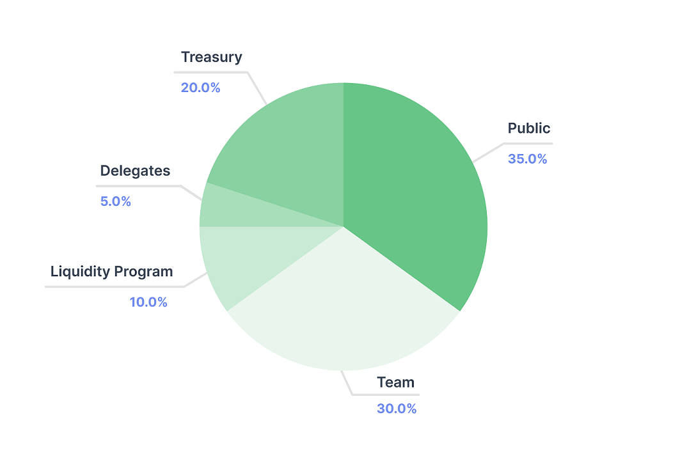

# IPT Sale

GFX Labs will start the sale of Interest Protocol Tokens (IPT) on August 15th. The sale will last until the allocated IPT for public distribution has been distributed. This post introduces both IPT and Governor Charlie, along with how the sale of IPT will take place.

## IPT and Governor Charlie

IPT holders collectively control the entire protocol and its revenues through the governance process. Because Interest Protocol (IP)'s contracts designate the core governance contract as their owner, IPT holders can propose and vote on changes to IP such as: adding new collateral assets, changing the parameters of existing collateral assets, updating the interest rate curve, and adjusting oracle contract combinations. They can also modify the governance and USDi contracts themselves to add additional features or update voting parameters. IPT holders also control how protocol fees are accrued and used. In short, IPT enables its holder to manage the entire protocol and its periphery contracts.

IP’s governance contract — aptly named Governor Charlie — is an extension of Compound’s Governor Bravo. Charlie inherits all the functionalities of Bravo but merges the governor and timelock contracts. In addition, Charlie introduces two new proposal types: emergency proposals and optimistic proposals. Emergency proposals are so IPT holders can make changes to the protocol contract on a faster timeline, albeit with a higher quorum threshold. Optimistic proposals will automatically pass and only require a low negative quorum to fail. 

## IPT Sale

We designed the sale to incentivize meaningful community participation from the outset. Instead of an airdrop, we chose to offer a small portion of IPT for sale daily for an extended period. By spreading out the sale period, the protocol can mature and garner more exposure to maximally distribute ownership of the protocol.
 
The GFX team will only retain a minority interest in the protocol. After the sale, GFX efforts will not be necessary for IP to function properly, and IPT holders will assume control of the protocol. GFX will continue to be involved in IP, but as community members with the same powers in governance as any token holder.
 
Below is the initial distribution of IPT total supply:

 
 
GFX has allocated 35,000,000 IPT (35% of the total token supply) to the token sale. Each IPT will sell for between 0.25 and 0.50 USDC, depending on demand. The exact price calculations are described below.
 
The new mechanism offers one million (1%) tokens per period at a starting price of $0.25 and a maximum price of $0.50. The sale has a minimum duration of 35 periods, a total of 32 days, to sell 35 million tokens (35% of the total supply) but will continue until the allocated supply is exhausted.
 
Each period, the sale parameters will reset to the base price ($0.25) and tokens offered (1m). The purchaser gets the same price regardless of the number of tokens purchased, but the price updates after each sale based on the number of total tokens purchased.
 
For example, at the beginning of a new day, a bidder could pay $250k (USDC) and receive 1m IPT; however, if the bidder instead paid $50k and received 200k IPT, then the next price would be $0.30. The next price is calculated by (tokens purchased / maximum offered)*(ceiling price - floor price) + floor price. Adjusting the price after a purchase encourages bidders to purchase while the remaining daily supply is high.
 
While the minimum duration of the sale is 35 days, which assumes maximum constant participation, we’re targeting closer to 2-3 months to complete the sale. By stretching out the sale over an extended period of time, the platform has more time to mature. From the distribution, during the sale, and thereafter the protocol is controlled by IPT holders.
 
GFX Labs will retain the right to change the maximum number of tokens offered, the duration of each period, the floor price, and the ceiling price. Since the IPT token will be in circulation outside our sale contract, the secondary market may independently develop. To reduce the arbitrage opportunity for MEV bots, we may increase the minimum price to align closer with the secondary market and favor people over bots.
 
Rather than doing a traditional 24 hours per period, we've chosen 22 hours. By selecting 22 hours, the start time will progressively change by two hours to make the sale more accessible across all time zones. 

## Participate
 
To participate, visit the [sale page](https://interestprotocol.io/#/sale). Review the User Agreement and [Token Sale Contract](https://etherscan.io/address/0xFbD3060Fe1Ed10c34E236Cee837d82F019cF1D1d#code). Purchasers need to set an allowance for their USDC to the sale contract. All purchases are immediately deliverable. 
 
This page is for general information purposes only. It should not be relied upon for accounting, legal, or tax advice.
