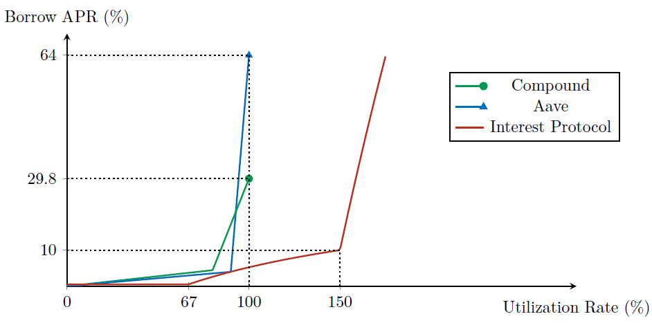

# Capital Efficiency of Interest Protocol

One of Interest Protocol's greatest advantages is its capital efficiency. Rather than lending out the USDC that users deposit, Interest Protocol keeps the USDC in reserve, and mints and lends out USDi against the USDC reserve. Compared to protocols that directly lend out USDC, this allows Interest Protocol to generate more loans from the same amount of capital while incurring less liquidity risk.

To illustrate this, suppose 1 USDC has been supplied to Compound, Aave, and Interest Protocol. How much loans can each protocol generate at a given level of interest rate? In other words, what *utilization rate* can each protocol achieve at a given level of interest rate? The following figure answers this question, using the current parameters of the three protocols.

At _any_ level of borrow APR, Interest Protocol has a higher utilization rate than Compound or Aave. In other words, given any borrow APR, Interest Protocol lends out more using the same amount of USDC.

One might ask if Interest Protocol is simply taking more risk than Compound or Aave. This is not the case. Let us define *liquidity risk* as the percentage of deposits that
are not immediately redeemable for the underlying USDC. For Interest Protocol, this is equal to (USDC in reserve) / (USDi total supply). For Compound and Aave, it is equal to their utilization rate. The figure below compares the liquidity risk for the three protocols at each level of utilization rate.

We can see that Interest Protocol has a lower liquidity risk at every level of utilization rate, compared to Compound or Aave.

Capital efficiency of Interest Protocol’s lending mechanism implies that USDi is highly scalable. Because Interest Protocol can supply a large amount of loans while minimizing
liquidity risk, USDi can scale flexibly in response to demand for leverage while maintaining a robust peg to the dollar.
